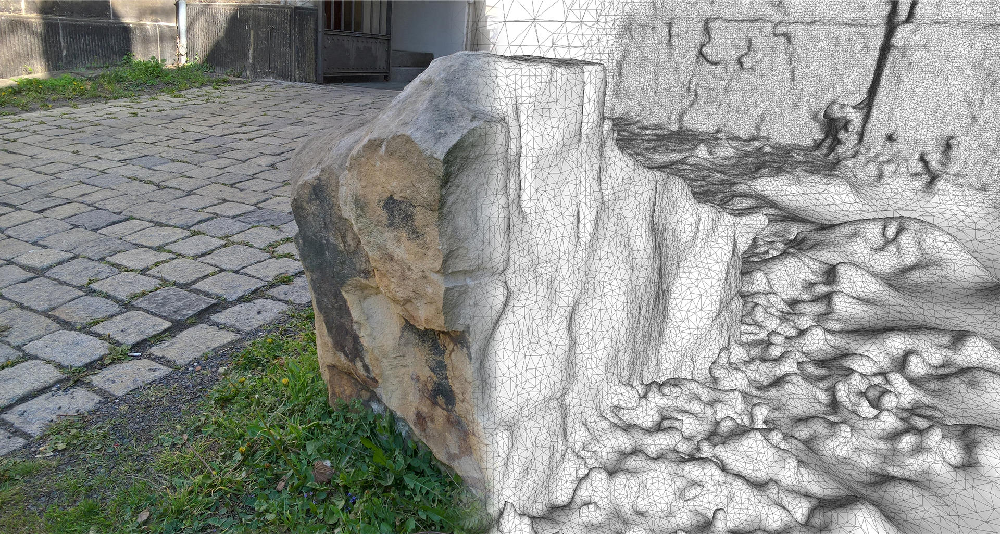
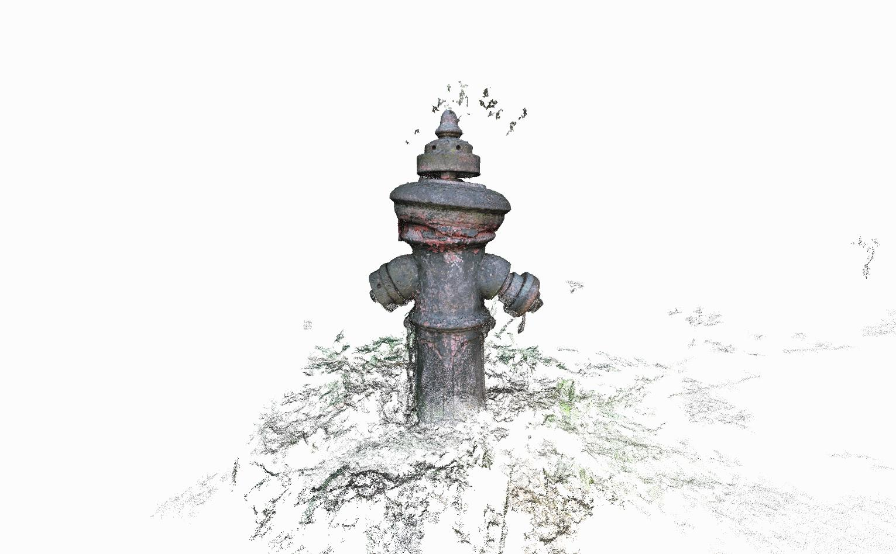

<!--
author:   Peter Wackernagel, Hochschule für Bildende Künste Dresden
email:    wackernagel@hfbk-dresden.de
version:  0.1.0
logo:     assets/logo.jpg
language: de
narrator: Deutsch Female
comment: Einführung in den fotogrammetrischen 3D-Scan - SoSe 2023
mode: Textbook
dark: true
date: 26/04/2022
@classroom: disable
@sharing: true
link: lia-style.css
-->

# Über

Aus realen Objekten und Räumen lassen sich mit einer digitalen Fotokamera im fotogrammetrischen 3D-Scanverfahren vergleichsweise einfach 3D-Modelle herstellen. Dabei lässt sich der Übergang vom Physischen zum Digitalen sehr direkt erleben. Dieser Kurs führt ein in die Handhabung des Scanverfahrens von der Aufnahmesituation bis hin zur Erstellung und Bearbeitung des 3D-Modells.

-------------------

Dieser Kurs lässt sich mit der eingebauten Übersetzungsfunktion (Google Translate) im Menu oben rechts übersetzen.

__Translate the course using the built-in translation function (Google Translate) in the top right menu.__

<!-- style="border: 1px solid black;" -->

---

# Verfahren

Als Scanobjekt eignen sich verschiedene Objekte und auch Räume.

---

_Digitale Fotos_ eines Raumes oder Objektes werden _aus mehreren Perspektiven_ aufgenommen.

---

Die Bilder werden um das Objekt herum aus mehreren Perspektiven und in kleinem Abstand zueinander aufgenommen.

---

Dieselben Oberflächenmerkmale müssen auf mehreren Bildern und aus mehreren Perspektiven erkennbar sein. Diese Bildmerkmale werden in der **feature detection** analysiert.

---

Die Bilder werden paarweise im **feature matching** miteinander verglichen. Je dichter die Aufnahmeperspektiven beieinander sind, desto mehr Gemeinsamkeiten können gefunden werden.

---

")<!--width="100%"-->

Anhand gemeinsamer Bildmerkmale werden die Positionen der Kameras zurückgerechnet.

---

Durch Wiederholung des vorgenannten Schrittes wird die gesamte Aufnahmesituation rekonstruiert. Dieser Schritt heißt **structure from motion**.

---

Der weitere Berechnungsablauf bis hin zum 3D-Modell ist komplex und untergliedert sich in mehrere aufeinander aufbauende Schritte.

---

Im Ergebnis erhält man ein texturiertes 3D-Modell, welches sich für viele Dinge weiternutzen lässt.

---

# technische Voraussetzungen

## Kamera

>Die meisten handelsüblichen Digitalkameras und auch Smartphones sind geeignet um Aufnahmen für die fotogrammetrische Berechnung zu machen.

Die Kamera sollte im besten Falle...

- __Exifdaten zu Kameramodell und Brennweite__ speichern
- ein Objektiv mit fester Brennweite haben. Bei Objektiven mit Zoom sollte der Zoom nicht genutzt werden.

Die **Brennweite** wird benötigt um die Linsenverzerrung aus dem Bild herauszurechnen, ähnlich wie bei der Objektivkorrektur in Fotosoftware.

Aus dem **Kameramodell** wird über Datenbanken die Sensorgröße ermittelt. Diese ist wichtig für den Schritt Structure from Motion.

Sind Brennweite und Kameramodell (Sensorgröße) unbekannt, dann werde Standardwerte genutzt, was zu Ungenauigkeiten führen kann. Je nach Programm ist die Berechnung dann auch nicht möglich. Manche Programme bieten zusätzliche Funktionen zur Kamerakalibrierung an.

GPS-Angaben werden, soweit vorhanden, vom Programm ausgewertet. Diese sind jedoch vor allem bei großräumigen Luftaufnahmen vom Flugzeug oder Drohnen aus relevant.

Hinweis zu Zoomobjektiven: Es darf zwischen Aufnahmen nicht gezoomt werden. Bei Zoomobjektiven möglichst die höchste oder niedrigste Zoomstufe wählen oder das Objektiv mit Klebeband fixieren, um ein versehentliches Zoomen zu verhindern. Erfordert die Aufnahmesituation Detailaufnahmen so sind diese durch näheres Herangehen mit derselben Brennweite zu erzielen.

## Aufnahme

")

>Es werden scharfe und qualitativ hochwertige Fotos benötigt, damit die Objektmerkmale gut erkennbar sind. -> feature detection

Bei den __Kameraeinstellungen__ ist zu beachten:

* Das Objekt von Interesse sollte fokussiert sein.
* Eine kleine Blende (hohe Blendenzahl) ist einzustellen für hohe Tiefenschärfe.
* Es sollte eine kurze Verschlusszeit gewählt werden zur Vermeidung von Bewegungsunschärfe.
* Eine niedrige ISO ist zu wählen für wenig Bildrauschen.

Es können auch Videodateien genutzt werden. Von diesen werden dann Einzelbilder im weiteren Prozess genutzt. Die Aufnahmequalität und auch die Auflösung von Videos sind in der Regel jedoch deutlich schlechter als die von Einzelfotos. Wenn möglich, dann sollte hier ganz besonders auf eine günstige Aufnahmesituation geachtet werden.

## Auflösung und Format

>Fotos sind im verbreiteten JPG-Format in hoher Qualität geeignet. RAW ist möglich, meist jedoch unnötig.
>Viele Bilder mit mittlerer Auflösung sind besser als wenige in hoher Auflösung.

Häufig ist es ausreichend und praktikabel, viele Bilder in mittlerer Auflösung (ca. 12 MP) zu machen. Eine höhere Auflösung kann zwar mehr Details abbilden, jedoch wird dafür auch mehr Rechenleistung benötigt. -> siehe Rechner

JPG-Dateien sollten in hoher Qualität gespeichert werden, damit keine [Kompressionsartefakte](https://de.wikipedia.org/wiki/Kompressionsartefakt) entstehen. Diese stören die **feature detection**.

RAW-Dateien sind zum Teil nutzbar und eigentlich auch gegenüber JPGs vorzuziehen, sie sind meistens aber nicht notwendig. Rohdaten erhöhen den notwendigen Speicherplatz stark. Nicht alle Programme unterstützen dieses Format.

Modernere Formate wie HEIF/HEIC, was zum Teil von neueren Smartphones verwendet wird, werden bisher nicht von den Berechnungsprogrammen unterstützt und müssen umgewandelt werden.

Die Fotos sind so zu verwenden, wie sie von der Kamera gespeichert werden. Sie dürfen insbesondere nicht geometrisch verformt oder beschnitten werden.  
Die Einstellung von Helligkeit und Kontrast in jedoch kein Problem und kann bei manchen Fotos auch notwendig sein.

## Rechner

> Es wird eine hohe Rechenleistunge benötigt. Handelsübliche Computer für Endanwender sind mit begrenztem Bildumfang und Geduld meist aber auch gut nutzbar.

Für die Berechnung wird Rechenleistung und Geduld benötigt. Trotz überlicherweise hoher Leistungsanforderungen sind haushaltsübliche Rechner meist in der Lage, kleinere Projekte von ca. 100 Bildern in mittlerer Qualität zu berechnen.

Über die Leistungsfähigkeit entscheiden im wesentlichen Arbeitsspeicher, Prozessor und Grafikkarte.

__Arbeitsspeicher (RAM)__  
Typischerweise sind 32 GB und mehr empfohlen. Der Arbeitsspeicher begrenzt vor allem die Menge der Gesamtpixel, die insgesamt berechnet werden können. Stürzt das Programm ab, dann steht in der Regel zu wenig Arbeitsspeicher zur Verfügung. Mit 8 GB Arbeitsspeicher lassen sich Projekte mit einem Bildumfang von ca. 100 Bildern in mittlerer Qualität berechnen.

__Prozessor__  
Ein moderner Mehrkernprozessor (Intel oder AMD) mit wenigstens 4-8 Kernen und 2+ GHz Taktfrequenz wird empfohlen. Je langsamer der Prozessor, desto mehr Geduld wird benötigt. Mit ausreichend Zeit kann die Berechnung auch auf langsamen Prozessoren gelingen. ARM-Prozessoren (wie auch der Apple M1) werden von den Programmen bisher nur wenig unterstützt.

__Grafikkarte__  
Eine Grafikkarte ist bei allen Programmen für die Darstellung der Punktwolken und Polygonnetze notwendig. Für viele Programme ist zudem eine CUDA-fähige Grafikkarte von NVidia notwendig für Teile der Berechnung. Hierzu mehr bei den Programmen.

__Festplatte und Speicher__  
Je nach Umfang des Bildersets entstehen während der Berechnung mehrere GB Arbeitsdaten im Projekt. Die Projektdaten sollten auf einm lokalen Datenträger abgelegt werden, Netzlaufwerke (POOL) sind zu langsam.

__Plattform__  
Die meisten Programme für werden für Windows oder Linux herausgegeben, was an der fehlenden Unterstützung von NVidia-Grafikkarten auf Apple-Systemen liegt. Wo CDUA keine Voraussetzung ist, laufen die Programme auch auf MacOS.

--------------

Eine gute Übersicht über die Systemanforderungen finden sich in den Angaben zu Metashape, die ungefähr für alle Programme gelten können: https://www.agisoft.com/downloads/system-requirements/

----------------

> Haushaltsübliche Rechner mit 8 GB Ram schaffen Projekte mit etwa 50 bis 100 Bildern bei einer Auflösung von je 12 Megapixeln (4000 x 3000 px). Dafür wird Zeit und Geduld gebraucht, die Berechnungen können bis zu mehreren Stunden dauern.

Gegebenenfalls sehr hoch aufgelöste Bilder können nachträglich verkleinert werden um sie der Systemleistung anzupassen.

Die Berechnungen können mehrere Stunden dauern. Der Rechner sollte während dessen nicht anderweitig genutzt werden.

## Programme

Es gibt viele Programme für die Berechnung des fotogrammetrischen Scans, freie und auch kommerzielle. Allerdings benötigen die meisten Programme die proprietäre Programmierschnittstelle [__CUDA__](https://en.wikipedia.org/wiki/CUDA), die nur für Nvidia Grafikkarten verfügbar ist. Da diese Karten auf Apple-Systemen kaum eingesetzt werden stehen daher nur wenige Programme für MacOS zur Verfügung.

In dieser Liste sind ein paar gängige und gut nutzbare Programme aufgeführt, die auch in der Werkstatt zur Nutzung zur Verfügung stehen:

---

**Agisoft Metashape** (Standard Edition)  

> Für professionelles und experimentelles Arbeiten auf Win, Mac und Linux, kommerziell

Plattform: Win, Mac, Linux; CUDA optional  
Lizenz: kommerziell; 30-Tage Demo, Student 59 USD, regulär 179 USD. **Educational-Lizenzen sind in der Werkstatt vorhanden**

Metashape ist die marktführende Anwendung für den fotogrammetrischen 3D-Scan mit einer einfachen Nutzeroberfläche und großem Funktionsumfang. Es sind verschiedene Bearbeitungsfunktionen für Punktwolken und Polygonnetze gleich im Programm integriert.  
[www.agisoft.com](https://www.agisoft.com)

---

**Meshroom**  

> Für professionelles und experimentelles Arbeiten auf Win und Linux mit NVidia-Grafikkarte, kostenfrei

Plattform: Win, Linux, ~~Mac~~; CUDA notwendig  
Lizenz: Open Source

Das Programm wird von Forschungseinrichtungen aktiv entwickelt, verwendet aktuelle Berechnungsalgorithmen und lässt daher sehr gute Ergebnisse erwarten. Es gibt einige Möglichkeiten zur Neuberechnung des Meshes (smoothing, decimating, denoising), eine manuelle Bearbeitung wie der Zuschnitt muss aber in anderen Programmen (z.B. Meshlab, Blender) erfolgen.  
CUDA ist notwendig für die Berechnung der Depth Maps, ohne CUDA lässt sich das Mesh jedoch in niedriger Qualität im draft meshing berechnen.  
[alicevision.org](https://alicevision.org/)

--- 

__VisualSFM + Meshlab__  

> Für experimentelles Arbeiten auf Win und Linux, kostenfrei

Plattform: __VisualSFM__: Win, Linux, ~~Mac~~; CUDA optional; __Meshlab__: Win, Mac, Linux; kein CUDA  
Lizenz: Open Source

VisualSFM wird für das Image Alignment und die Dense Cloud genutzt. Das Programm wird nicht mehr weiterentwickelt, die Berechnung bringt weiterhin gute Ergebnisse: http://ccwu.me/vsfm/ Meshlab wird dann für das Meshing und Texturing genutzt. Meshlab bietet zudem viele Bearbeitungsfunktionen für Punktwolken und Polygonnetze.  
[www.meshlab.net](http://www.meshlab.net/)

--- 

**Regard3D**  

> Für experimentelles Arbeiten auf Win, Mac und Linux, kostenfrei

Plattform: Win, Mac, Linux; kein CUDA  
Lizenz: Open Source

Regard3D setzt für den ersten Berechnungsabschnitt (Structure from Motion) aus Lizenzgründen auf ältere Berechnungsalgorithmen und ist dort daher vergleichsweise langsam und weniger zuverlässig. Bei guten Bildern und etwas Geduld können aber auch hier gute Ergebnisse erzielt werden. Die Berechnung der Dense Scene und des Meshes ist dann in hoher Qualität möglich. Dies ist das einzige Open-Source-Programm mit grafischer Nutzeroberfläche, welches auch auf MacOS läuft.  
[www.regard3d.org](http://www.regard3d.org/index.php)

---

**PolyCam** und **KIRI Engine**

> Für experimentelles Arbeiten auf iOS und Android, kostenfrei/kommerziell

Plattform: iOS und Android
Lizenz: Freemium

https://poly.cam/

https://www.kiriengine.app/

---

Es gibt viele weitere Programme und auch Smartphone-Apps. Eine Übersicht gibt es beispielsweise hier: https://all3dp.com/1/best-photogrammetry-software/

# Image Capture

Nur die Auswahl des Objekts, die Aufnahmesituation und die Handhabung der Kamera sind die Dinge, die der Nutzer maßgeblich bestimmen kann.

In der weiteren Berechnung lassen sich zwar manche Variablen einstellen, nicht jedoch schlecht aufgenommene Bilder ausgleichen.

---

Die wesentlichen Bedingungen für Objekte und Aufnahmen lassen sich aus der Betrachtung der ersten beiden Berechnungsschritte des Image Alignments ableiten...

---

__1. Image description__  

>__Die Oberflächenmerkmale des Objektes müssen bei der _image description_ klar erkannt werden können.__

---

__2. Image Matching__  

>__Die Bildmerkmale müssen beim _image matching_ klar einander zugeordnet werden können.__

---

Daraus lassen sich für die Berechnung günstige und weniger günstige Objektoberflächen ableiten...

**geeignete Oberflächen**

Objekte mit __matter Oberfläche__ und mit vielfältigen __Oberflächenmerkmalen__ wie Farbflecken, Strukturen und Schmutz __eignen sich sehr gut__ für dieses Scanverfahren.

---

**ungeeignete Oberflächen**

---

__Problemfälle lösen__

 Sofern es für das Objekt verträglich ist, können monochrome, glänzende oder transparente Objekte beispielsweise mit matter Wasserfarbe oder abwaschbarem [Kreidespray](https://www.wolkdirekt.com/colormark-ecomarker-_-5686907.html) matt und fleckig gemacht werden. 
Reflektionen lassen sich auch mit einem [Polarisationsfilter](https://de.wikipedia.org/wiki/Polarisationsfilter) während der Aufnahme reduzieren.

---

## Bilder aufnehmen

Bilder werden um ein Objekt herum aus mehreren Höhen und in kleinem Abstand zueinander aufgenommen. 

* Bilder sind kleinschrittig um das Objekt herum aus verschiedenen Perspektiven aufzunehmen.
* Die Bilder müssen in keiner bestimmten Reihenfolge aufgenommen werden. Die Reihenfolge sollte an die Gegebenheiten angepasst sein.
* Der Bildausschnitt ist zu beachten. Das Objekt von Interesse sollte das Bild gut ausfüllen.
* Bei Situationen, in denen das Objekt nicht vollständig erfasst werden kann, sind Detailaufnahmen möglich.
* Es darf nicht gezoomt werden. Nahaufnahmen sind durch Herangehen zu tätigen.
* Aufnahmen von Abschnitten sind mit großzügiger Überlappung von mindestens 60% zu tätigen.

Im Hinblick auf die **Kameraeinstellungen** ist für die Aufnahmesituation zu beachten:

* Beleuchtung so wählen, dass kurze Belichtungszeiten möglich sind.
* Gegebenenfalls Stativ nutzen
* Eine günstige Aufnahmesituation ist im Außenraum bei Halbschatten oder an einem bewölktem Tag
* Objekte dürfen sich nicht bewegen.

---

Vergleiche zusätzlich auch die Tipps von

* Agisoft Metashape: https://agisoft.freshdesk.com/support/solutions/articles/31000149337-general-image-capture-tips
* Alicevision Meshroom: https://meshroom-manual.readthedocs.io/en/latest/capturing/capturing.html

---

## Projekt einrichten

* Alle Bilder sollten auf die lokale Festplatte kopiert werden. Die Verwendung von Netzlaufwerken macht die Berechnung sehr viel langsamer.
* Verwende keine Umlaute (ä, ü, ö, ß) im gesamten Pfad (alle Ordnernamen) und den Dateinamen! Es kann sonst zu Fehlern bei manchen Berechnungsschritten oder in manchen Exportformaten kommen. Auch manche Sonderzeichen wie = und ' können Probleme machen.
* Schlechte Fotos sollten aussortiert werden.
* Die Bilder dürfen nicht zugeschnitten werden oder sonstwie geometrisch verformt werden.
* nach Bedarf können die Bilder verkleinert werden. Nutzt dazu die Stapelverarbeitung von Grafikprogrammen, zum Beispiel mit IrfanView: [Texttutorial](https://gregor-moellring.de/anleitungen/viele-bilder-aendern-mit-irfanview/), oder [Videotutorial](https://www.youtube.com/watch?v=h49naM9aI-A)

# Programmtutorials

Alle nachfolgenden Programme können auf den Rechnern der Werkstatt in der Hochschule genutzt werden.

Für Agisoft Metashape sind Studienlizenzen aktiviert.

Alicevision Meshroom bietet nur im 3D-Labor auf der Güntzstraße den vollen Funktionsumfang (wegen CUDA).

## Agisoft Metashape

Download (Metashape Standard): https://www.agisoft.com/

__Genereller Ablauf__

Der generelle Ablauf ist in der Metashape-Hilfe beschrieben: _"Help -> Contents -> General Workflow"_ oder auch hier als bebildertes Tutorial: https://agisoft.freshdesk.com/support/solutions/articles/31000152092

Metashape bietet sowohl den Workflow über die Depth Maps, als auch über die Dense Cloud an.

-------------

1. Über die Dense Cloud mit der Möglichkeit ihrer Bereinigung

* Add Photos
* Workflow -> Align Photos danach optional: move/resize/rotate Region
* Workflow -> Build Dense Cloud danach optional: Tools -> Dense Cloud -> Filter/Select, oder manuell über Toolbar: Punkte auswählen und löschen
* Workflow -> Build Mesh (Source: Dense Cloud) danach optional: Tools -> Mesh -> decimate/smooth/Refine/Close holes/...
* Workflow -> Build Texture

Videotutorial auf Youtube: [Photogrammetry / Basic workflow in Metashape](https://www.youtube.com/watch?v=419-DLD42Oc)

!?[Youtube](https://www.youtube.com/watch?v=419-DLD42Oc)

------------

2. Aus dem Alignment direkt über die Depth Maps

* Add Photos
* Workflow -> Align Photos optional: move/resize/rotate Region
* Workflow -> Build Mesh (Source: Depth Maps) danach optional: Tools -> Mesh -> decimate/smooth/Refine/Close holes/...
* Workflow -> Build Texture

Videotutorial auf Youtube: [Photogrammetry / Basic workflow in Metashape Part2](https://www.youtube.com/watch?v=H6CNCbHAnQM)

!?[Youtube](https://www.youtube.com/watch?v=H6CNCbHAnQM)

------------

__Workflow Turntable__

Für Aufnahmen mit dem Turntable müssen die Fotos zunächst maskiert werden. Der (statische) Hintergrund wird dabei markiert, sodass er nicht bei der Berechnung berücksichtigt wird und nur das (bewegte) Vordergrundobjekt berechnet wird.

Hinweise dazu gibt es in der Metashape-Hilfe: "Help -> Contents -> Editing -> Using masks"

Youtube: [Masking Photos with Agisoft Photoscan](https://www.youtube.com/watch?v=A-N8zD6svvY) (manuelles maskieren)

!?[Youtube](https://www.youtube.com/watch?v=A-N8zD6svvY)

Youtube: [Masking using backgrounds Agisoft](https://www.youtube.com/watch?v=feOo3KI-J-U) (automatisches maskieren)

!?[Youtube](https://www.youtube.com/watch?v=feOo3KI-J-U)

## Meshroom

Alicevision Meshroom benötigt für den vollen Funktionsumfang einen Computer mit CUDA-fähiger Grafikkarte. Download: https://alicevision.org/

Standardablauf: https://meshroom-manual.readthedocs.io/en/latest/tutorials/sketchfab/sketchfab.html

Turntable: https://meshroom-manual.readthedocs.io/en/latest/tutorials/turntable/turntable.html

weitere Hinweise finden sich im Handbuch: https://meshroom-manual.readthedocs.io/en/latest/

--------------

### Tipps und Tricks

__Draft Meshing__ ist eine Möglichkeit Meshroom auch ohne CUDA zu vervenden. Dabei wird ohne DepthMaps gerechnet. Das Ergebnis ist geringer aufgelöst als die volle Berechnung, jedoch geht es auch deutlich schneller. Folgendes Node-Setup ist dafür zu verwenden:

Es sollte beim draft-meshing das HIGH preset in der FeatureExtraction node genutzt werden um eine ausreichend dichte Punktwolke (sparse cloud) für das weitere Meshing zu erhalten. Details in den [Reconstruction-parameters](https://github.com/alicevision/meshroom/wiki/Reconstruction-parameters)

Originalbeitrag zu diesem Thema (Achtung: Node-Setup aus vorheriger Programmversion): https://github.com/alicevision/meshroom/wiki/Draft-Meshing

-------------

Automatische Objektskalierung mit __CCTAG Scaling__: https://github.com/alicevision/meshroom/wiki/CCTAG-scaling

---------------

__Bounding Box__ (Crop Reconstruction Region): https://github.com/alicevision/meshroom/wiki/Bounding-Box

---------------

__Weiterbearbeitung__

Die Daten lassen sich mit dem Blender Addon [Photogrammetry Importer](https://github.com/SBCV/Blender-Addon-Photogrammetry-Importer) nach Blender übertragen. Die Bedienung dieses Addons ist dort dokumentiert.

## VisualSFM + Meshlab

Mit VisualSfM und Meshlab lassen sich sehr gute Ergebnisse erzielen. Beide Programme machen den Bearbeitungsprozess sehr transparent, da jeder Schritt manuell ausgeführt wird. Dadurch muss man sich in jeden Schritt sehr hineinfühlen, hat aber auch sehr viele  Gestaltungsmöglichkeiten.

VisualSFM wird für das Image Alignment und die Dense Cloud genutzt. Das Programm wird nicht mehr weiterentwickelt, die Berechnung bringt weiterhin gute Ergebnisse.  
Meshlab wird für das Meshing und Texturing genutzt und bietet zudem viele Bearbeitungsfunktionen für Punktwolken und Polygonnetze.

### Installation

VisualSFM kann hier heruntergeladen werden: http://ccwu.me/vsfm/  
Die Installationsanleitung ist hier zu beachten. Es werden zusätzliche Dateien für die Berechnung der Dense Cloud benötigt, die an anderer Stelle heruntergeladen und manuell in den Programmordner kopiert werden müssen

Meshlab: [www.meshlab.net](http://www.meshlab.net/)  
Der Installer enthält alles notwendige.

### VisualSFM

#### Add some images

 „Open multiple Images“

Im Auswahlfenster lassen sich alle Bilder mit der Tastenkombination Strg + A auswählen.

VisualSFM beschränkt die verarbeitete Bildgröße standardmäßig auf 3200 px und sucht außerdem bei der Bildberechnung nach mehreren Modellen. Diese Einstellungen sollten gegebenenfalls geändert werden:
- Menu → SfM → More Functions → Search Multiple Models (Häkchen deaktivieren)  
- Menu → Tools → Enable GPU → Set Maximum DIM (mindestens die lange Kante der Fotos angeben)

Gegebenenfalls bietet es sich an, die Pixelmaße der Fotos vor dem Import zu reduzieren. (Im Batch mode mit Photoshop oder auch gut mit IrfanView unter Windows)

#### Match the images (feature detection + matching)

 „Compute Missing Matches“

Die Berechnung dauert wenige Minuten bis hin zu mehreren Stunden, abhängig von Größe, Anzahl und Komplexität der Fotos.

Nach Abschluss des Vergleichs (siehe Log) lassen sich die Matches anzeigen über  
→ Menu → View → Inlier Matches / Feature Matches.

#### Sparse Reconstrucion (Structure from Motion)

 „Run 3D-Reconstruction“

Die Bilder werden nacheinander im Raum angeordnet. Mit der Maus kann im Raum navigiert werden. Die Größe der Kameras kann mit Strg+Mausrad verändert werden.

#### Dense Reconstruction (Dense Scene)

 „Run Dense Reconstruction“

Das Symbol für die Dense Reconstruction (CMVS) erscheint erst bei fertiger Sparse Reconstruction.

Zuerst erscheint eine Aufforderung, die Projektdatei zu speichern (*.nvm – N-View Match). Vergeben Sie einen beliebigen Namen, verwenden Sie keine Umlaute (Meshlab hat damit Probleme).

Nach etwas Zeit erscheint im Log die Meldung „This may take a little more time...“ und das Programm scheint nicht weiter zu arbeiten. Diese ‚little more time‘ kann wenige Minuten bis hin zu mehreren Stunden dauern.

Da es keinen Fortschrittsbalken gibt können Sie den Taskmanager aufrufen um die Aktivität des Rechners zu überprüfen: rechter Mausklick auf Windows Taskleiste → Taskmanager; dann den Reiter Leistung auswählen.

Am Ende der Berechnung wird die dense cloud automatisch in der Datei projektname.ply gespeichert.

Sie können die Ansicht zwischen Sparse und Dense Cloud umschalten über → Menu → View → Dense 3D Points / N-View 3D points, oder die Tabulatortaste. Außerdem lässt sich unter → View → Perspective View die perspektivische Ansicht einstellen.

#### Nachbereitungen

Alle Dateien sind bereits gespeichert. Es werden weiterhin nur die Fotos, die Datei Projektname.nvm (sparse cloud) sowie Projektname.0.ply (dense cloud) benötigt.

Die zusätzlich sich im Ordner befindenden Dateien *.sift und *.mat sowie der Ordner projektname.nvm.cmvs belegen viel Speicherplatz und können gelöscht werden.

---

### Meshlab

#### Datenimport

In Meshlab werden die nacheinander die Projektdatei *your-project.nvm* sowie die dense cloud *your-project.0.ply* geladen

Open Project: 
- File → Open Project (oder über Symbolmenu) ...  *your-project.nvm* auswählen
- ... und ein wenig warten, bis alles geladen wurde.

Am rechten Bildrand öffnet sich ein Dialog mit Layern. Sollten keine Punkte sichtbar sein, dann kann dort die Anzeige der Punkte für eben geladenen Layer aktiviert werden.

Info: Die Projektdatei enthält Informationen über die ausgerichteten Fotos. Im Layer Dialog sind die Fotos mit Namen gelistet. Die Kameras lassen sich sichtbar machen über → Render → Show Camera, ihre Größe muss für sinnvolle Ansicht im Layer Dialog eingestellt werden (Scale Method - Fixed Factor; Scale Factor z.b. 0.05 – Punkt, nicht Komma!). Diese Anzeige ist nur Informativ und für die weitere Arbeit nicht zwingend notwendig.

Import Mesh:
- File → Import mesh (oder über Symbolmenu) ... *your-project.0.ply*

---

#### Dense Cloud bearbeiten (optional)

Nur bei Bedarf lassen sich in der dense cloud zuerst falsche oder unnötige Punkte (hier „Vertexes“) auswählen und löschen. Hier muss man sehr sorgfältig sein, Meshlab kennt kein Undo!  

Folgende Möglichkeiten bieten sich an:
- Vertexes auswählen und löschen mit den Symbolen im Symbolmenu (siehe oben)
- Zuerst den Bereich zum Behalten auswählen, dann Auswahl invertieren über → Filters → Selection → Invert Selection (+Apply) und dann löschen
- Vertexes nach Farbe auswählen → Filters → Selection → Select Faces by Color (Vertices sind keine Faces, es funktioniert trotzdem)

#### Meshing

Stellen Sie sicher, dass im Layer Dialog die Dense Cloud ausgewählt ist.

Oberflächenmodell (Polygonnetz, Mesh) generieren:  
- Filters → Remeshing, Simplification and Reconstruction → Surface Reconstruction: Screened Poisson
	- Reconstruction Depth – gibt die allgemeine Dichte an in der rekonstruiert wird. Sinnvoll sind Werte von 8 bis 13. Je höher der Wert, desto länger dauert die Berechnung
	- Minimum Number of Samples – Gibt an, wie viele Punkte für jedes Oberflächensegment berücksichtigt werden. Werte von 1 (rauhes Mesh) bis 20 und aufwärts (weiches Mesh)
	- Interpolation Weight – gibt an, wie weit das Mesh dorthin interpoliert wird, wo keine Punkte sind. Werte von 0 bis 100 und mehr. Je höher, desto stärker werden Löcher in der Punktwolke zugezogen. Aufwärts von 10 können dadurch aber unschöne Spitzen selbst bei kleinen Löchern entstehen, 4 bis 10 empfohlen.
	- Confidence flag – ist hier nicht zu benutzen, bringt hier nur Fehler
	- Pre Clean – ist hier nicht notwendig
	- Informationen finden sich unter dem Knopf ‚Help‘
	- weitere Einstellungen finden sich unter dem schwarzen Pfeil.

Info: Im Ergebnis erhalten Sie ein Polygonnetz (Mesh) aus einer Vielzahl von Dreiecken mit Vertex Colors. Diese Farbwerte sind zusammen mit der Geometrie gespeichert und genau so fein aufgelöst wie die Dreiecke. Das Mesh kann unterschiedlich angezeigt werden: Als Gitternetz, weich oder flach schattiert, mit oder ohne Farbe. Siehe dazu auch die Optionen im Layer Dialog.

Bei Bedarf nun noch fehlerhafte oder ungewollte Stellen im Mesh löschen: Über das Symbolmenu Faces auswählen und Löschen (Achtung, kein Undo!)

Bei Bedarf kann das Mesh dann noch dezimiert werden. Die vorangegangene Surface Reconstruction erstellt ein weitgehend gleichmäßig aufgelöstes Mesh. Dabei kann ein Mesh mit mehreren Millionen Polygonen entstehen, was nicht für jede Anwendung günstig ist und schnell den Rechner an den Rand seiner Leistungsfähigkeit bringen kann. Für viele Anwendungen reichen wenige hunderttausend Polygone

→ Filters → Remeshing, Simplification and Reconstruction → Simplification: Quadric Edge Collapse Dezimation (hier den Filter ohne Textur auswählen!)

-   es lässt sich eine Zielanzahl von Polygonen oder ein Anteil am Ausgangswert in Dezimalstellen (0 – 1; z.B. 50% entspricht 0.5) eingeben

Nach der Dezimierung muss das Mesh meist noch gesäubert und Fehlstellen beseitigt werden:

→ Filters → Cleaning an Repairing → Remove Faces from non Manifold Edges  
… → Remove Duplicate Vertices / Faces

Bei Bedarf kann das Mesh auch nachträglich noch geglättet werden, z.B. mit

→ Filters → Smoothing, Fairing, Deformation → Laplacian Smooth

Ist nur die Geometrie von Interesse dann kann das Mesh hier bereits zur weiteren Verwendung exportiert werden.

#### Texturing

Die Textur gibt dem Mesh reichhaltigere Oberflächeninformationen unabhängig von dessen Auflösung.

Zunächst ist sicher zu stellen, dass im Layer Dialog das richtige Mesh ausgewählt ist.

Zuerst wird eine UV Map („UV Atlas“) erstellt:  
- Filters → Texture → Parameterization from registered rasters

Dann werden die Fotos auf das Mesh projiziert:
- Filters → Texture → project active rasters color to current mesh, filling the texture
	- die Textur wird in der gewählten Texture size quadratisch ausgegeben (z.B. 1024 x 1024 Pixel)
	- Für Texturen üblich sind Werte im vielfachen von 8... 256, 512, 1024, 2048, 4096, 8192

Wenn das Mesh zuvor gespeichert wurde, dann wird im Dateiordner eine Bilddatei für die Texture erstellt. Wurde das Mesh zuvor nicht gespeichert, dann wird die Bilddatei mit diesem Zusammen beim Export gespeichert.

#### Export

Sicherstellen, dass im Layer Dialog das richtige Mesh ausgewählt ist.

→ Menu → File → Export Mesh As…

Passende Dateiformate zum Archivieren und Austausch: OBJ, DAE

Blender importiert:
- Collada DAE (UVMap/Textur + Vertex Colors)  
- Wavefront OBJ (UVMap/Textur, keine Vertex Colors, Custom Normals)

Meshmixer importiert:
- Wavefront OBJ (UVMap/Textur + Vertex Colors)

## Regard3D

Regard3D nutzt für das Image Alignment nicht die neuesten Algorithmen, kann bei der Dense Scene und dem Meshing dann aber gute Ergebnisse erzielen. Dafür benötigt das Programm kein CUDA und läuft als einziges mir bekanntes Scanprogramm mit grafischer Nutzeroberfläche auf allen Plattformen.

Webseite: http://www.regard3d.org/

__Handhabung des Programms__

Tutorial: http://www.regard3d.org/index.php/documentation/tutorial

---------------

__Weiterbearbeitung__

Die Daten lassen sich mit dem Blender Addon [Photogrammetry Importer](https://github.com/SBCV/Blender-Addon-Photogrammetry-Importer) nach Blender übertragen. Die Bedienung dieses Addons ist dort dokumentiert.

# Beispiele

__Hydrant__

Mit vielfältigen Oberflächenmerkmale, die gut voneinander unterschieden werden können, lässt sich der Hydrant hervorragend im fotogrammetrischen Scanverfahren berechnen. Die Dense Cloud ist sehr dicht und das daraus errechnete Polygonnetz sehr detailliert.

---

__Mülleimer__

Die einfarbigen Bereiche des Mülleimers bieten zu wenige abgrenzbare Features, die dense cloud nur unvollständig berechnet wird. Die Löcher werden durch Interpolation zwar gefüllt, bilden die eigentliche Oberfläche jedoch nicht ab. 
Der Fußboden direkt um den Eimer herum wurde hingegen dank vielfältiger Merkmale sehr gut rekonstruiert.

__Küche__

Die weißen Flächen des Schranks haben keine für die _feature detection_ erkennbaren Merkmale, daher werden fast nur die kontrastreichen Kanten in der denso cloud rekonstruiert. Die Rekonstruktion des Meshes gelingt daher nur mit vielen Ungenauigkeiten.
