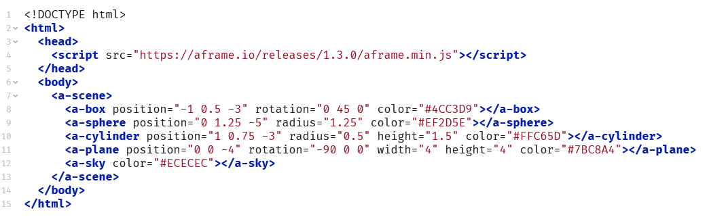
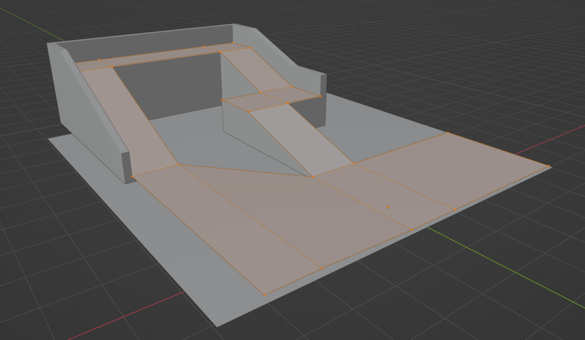
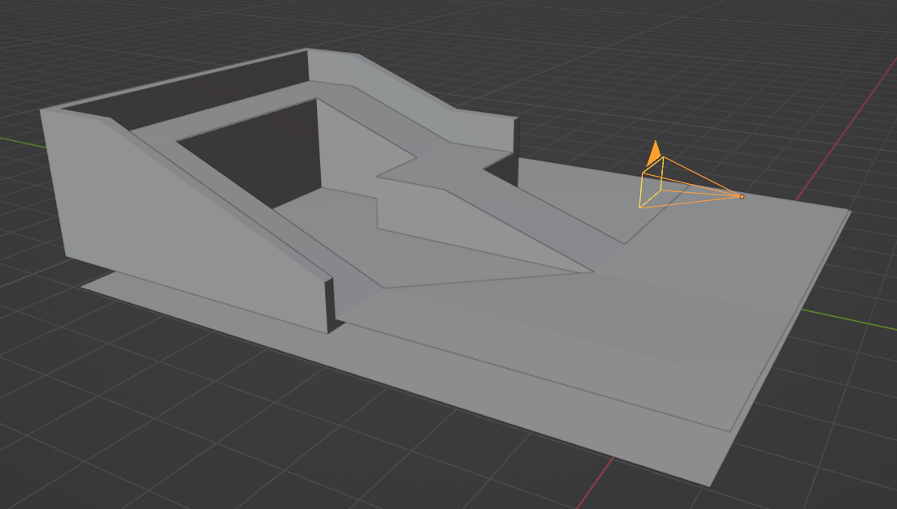
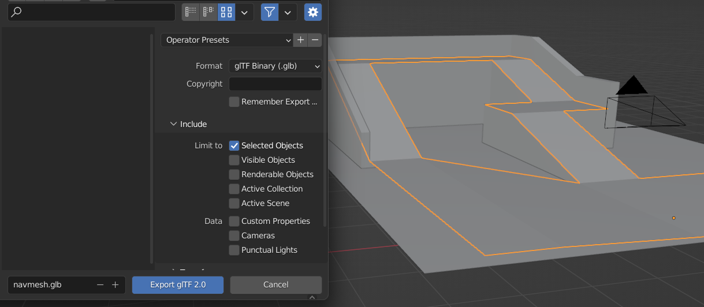

<!--
author:   Peter Wackernagel, Hochschule für Bildende Künste Dresden
email:    wackernagel@hfbk-dresden.de
version:  0.0.7
logo:     A-Frame-logo.png
language: en
narrator: English Female
comment:  Digital spaces in VR with A-Frame
mode:     textbook
dark:     false
date:     19/12/2023
@classroom: disable
@sharing: true
-->

# 1 Introduction

[A-Frame](https://aframe.io/docs/1.4.0/introduction/) is an open source project that allows you to build VR on top of regular HTML, so you can create a WebXR experience just as easily as you can make a web page, simply by including a script and markup in your page. With A-Frame, you can create cross-platform VR apps that users across multiple device types can access.

---

**A-Frame Samples**

Sample applications on the A-Frame home page: [https://aframe.io/](https://aframe.io/)


Navigation in the scenes is done

- on **desktop** with the arrow keys or WASD (if enabled)
- on **mobile devices** with finger gestures
- on **VR headsets** by active body movement.
- The **VR** button in the right corner puts the scene in full screen or VR view.

More examples: [glitch.com/webxr](https://glitch.com/webxr)

---

## HTML-Code



- HTML (Hyper Text markup Language) is the language used to describe web pages.
- A-Frame uses this language to describe the objects of the scene

---

**Tags**

```html
<tag></tag>
```

- An HTML element consists of **tags**. It is always formed from an opening-tag and a closing-tag.
- Tags can have different names and thus different functions.
- tags must be surrounded by angle brackets, the closing-tag has a preceding slash.

---

**Attributes**

```html
<tag attribute></tag>

<tag attribute="value"></tag>
```

- In the opening-tag there can be attributes that define further properties of the element.
- Attributes often also have a value, which consists of numbers, color values or text expressions.
- Attribute and value are connected without spaces with the is-equal sign, the value is always in quotes.

---

**Nested elements**

```html
<tag1 attribute="value">
	<tag2 attribute="value"></tag2>
	<tag3 attribute="value"></tag3>
</tag1>
```

- Elements can be nested and placed between the opening-tag and the closing-tag of the outer element..
- This way, tag1 works like a container which groups the nested tags together.

---

**Comments**

```html
<tag attribute="value">
	<tag2 attribute="value"></tag2> <!-- this comment will not be interpreted by the browser -->
</tag>
```

- Comments can be included with hints about the code.
- Comments are framed with angle brackets, execution marks and 2 minus signs as above.

---

**Syntax**

```html
<tag attribute="value"></tag>
```

- the correct use of characters is essential
- missing brackets or quotation marks or additional spaces in attributes lead to errors in the display.
- HTML for web pages still uses content between tags. For A-Frame this is unnecessary.

---

**Structure of an HTML page**

```html
<!DOCTYPE html>
<html>  
	<head>  <!-- invisible part with metadata and scripts -->  </head>  
	<body>  <!-- visible part with texts, media, A-Frame scene -->  </body>  
</html>
```

- The basic structure of an HTML page is standardized and is divided into the areas:

	- Head: invisible part with metadata and scripts.
	- Body: visible part with texts, media, AFrame scene.

- Blank lines can be placed between them as desired and make it easier to keep track.
- There should be no text outside of tags, except for comments.

---

## Starter Template


```html
<!DOCTYPE html>
<html>  
  <head>  
    <script src="https://aframe.io/releases/1.4.1/aframe.min.js"></script>  
  </head>  
  <body>  
    <a-scene>  
      <a-box position="-1 0.5 -3" rotation="0 45 0" color="#4CC3D9"></a-box>  
      <a-sphere position="0 1.25 -5" radius="1.25" color="#EF2D5E"></a-sphere>  
      <a-cylinder position="1 0.75 -3" radius="0.5" height="1.5" color="#FFC65D"></a-cylinder>  
      <a-plane position="0 0 -4" rotation="-90 0 0" width="4" height="4" color="#7BC8A4"></a-plane>  
      <a-sky color="#ECECEC"></a-sky>  
    </a-scene>  
  </body>  
</html>
```

The code-highlighting makes it easier for us to distinguish the individual components.

---

**Script**

```html
  <head>  
    <script src="https://aframe.io/releases/1.4.0/aframe.min.js"></script>  
  </head>  
```

The Java script linked in the head is what makes the scene work. This is the actual A-Frame "program".

It is a program code that interprets the scene specified in the body, displays it and controls its operation on different devices.

This program code can be viewed by calling the URL directly in the browser:

- Data saving minimized variant, poorly readable for humans: https://aframe.io/releases/latest/aframe.min.js
- Structured, annotated and easy to read variant: https://aframe.io/releases/latest/aframe.js
- There are different versions of the script that you can see in the URL to the script.

---

**Scene**

```html
<a-scene>  
	<a-box position="-1 0.5 -3" rotation="0 45 0" color="#4CC3D9"></a-box>  
	<a-sphere position="0 1.25 -5" radius="1.25" color="#EF2D5E"></a-sphere>  
	<a-cylinder position="1 0.75 -3" radius="0.5" height="1.5" color="#FFC65D"></a-cylinder>  
	<a-plane position="0 0 -4" rotation="-90 0 0" width="4" height="4" color="#7BC8A4"></a-plane>  
	<a-sky color="#ECECEC"></a-sky>  
</a-scene>  
```

- The A-Frame scene is initialized by the *a-scene* tag. The scene objects are nested inside this tag.
- All tags belonging to A-Frame have a prefix *a-* to distinguish them from standard HTML tags.

---

Each **element** *a-box*, *a-sphere*, *a-cylinder* etc. describes a single **object** within the scene.


--- 

The **properties** of each Object are attached as **attributes**.


- position = x y z = width height depth

	- Numbers separated by blanks, in meters but without units
	- Depth z: -z moves away from the camera. Positive values are behind the camera

- rotation: data as for position
- radius, width, height: data depending on object type (cylinder, surface)
- color: hexadecimal specification: red, green and blue components:

	- Hex Colors: https://www.w3schools.com/colors/colors_hexadecimal.asp
	- color Picker: https://www.w3schools.com/colors/colors_picker.asp
	- color names are also possible: https://www.w3schools.com/colors/colors_names.asp

---

## Start your Project

**Code Hosting**

A server environment is required for A-Frame to run in the browser. The easiest way to start is to use the code hosting platform Glitch.com to develop your own project. There you will also find numerous projects that can be built upon. 

Advantages of code hosting:

- immediate deployment online, no need to have your own hosting
- full function of dynamic scripts

--- 

**Starter Template**

We'll use the A-Frame Starter-Template on glitch.com: [https://glitch.com/~aframe](https://glitch.com/~aframe)


> Hit **Remix your own** to start your own project based on this project.
> Play around with this scene to see what will happen.

---

# 2 Objects

## A-Frame Primitives

A-Frame provides a handful of elements such as *a-box* or *a-sky* called primitives that wrap the entity-component pattern to make it appealing for beginners. These are some examples with additional attributes:

---

**a-box**

The box primitive creates shapes such as boxes, cubes, or walls.

```html
<a-box width="0.5" height="2" depth="1" position="-1 1 -4" color="red"></a-box>
<a-box width="1" height="0.5" depth="2" position="1 1 -4" color="green" wireframe="true" wireframe-linewidth="2"></a-box>
```

---

**a-cylinder**

The cylinder primitive is used to create tubes and curved surfaces.

```html
<a-cylinder color="crimson" height="3" radius="1.5" position="0 1 -5"></a-cylinder>
```

---

**a-plane**

The plane primitive creates flat surfaces.

```html
<a-plane position="0 1 -4" rotation="0 45 0" width="4" height="4" color="#7BC8A4"></a-plane>
<a-plane color="grey" height="20" width="20" position="0 0 -10" rotation="-90 0 0"></a-plane> <!-- Ground plane -->
```

---

**a-sphere**

The sphere primitive creates a spherical or polyhedron shapes.

```html
<a-sphere color="yellow" radius="1" position="0 1 -5"></a-sphere>
```

---

**a-text**

Adds a text.

```html
<a-text value="Hello, World!" color="black" position="0 1 -3"></a-text>
```

---

**a-image**

The image primitive shows an image on a flat plane.

```html
<a-image src="image.jpg" width="3" height="2" position="0 1 -5"></a-image>
```

- mages can be uploaded on glitch into the **assets**-folder. Copy their URL from there and paste it into the src-attribute of the element.
- Set the width and height preserving the original aspect ratio of the image to avoid distortions. This properties are set in meters, don’t confuse with pixels.

---

**a-sky**

The sky primitive adds a background color or 360° image to a scene. A sky is a large sphere with a color or texture mapped to the inside.

``` html
<a-sky color="#6EBAA7"></a-sky> <!-- background color -->
<a-sky src="sky.jpg"></a-sky> <!-- equirectangular background-image -->
```

- You can download Sky-Images here: https://polyhaven.com/hdris ... Download the 8K Tonemapped-JPG from the menu on the upper right and [[2b Optimizing Media|optimize]] for web

---

**More**

You can find every primitive that A-Frame provides out of the box at the bottom of the documentation navigation sidebar: https://aframe.io/docs/1.4.0/primitives/a-box.html

Developers can create their own primitives as well.

---

## A-Frame Entities

A-Frame elements can be specified in 2 ways: as a specialized primitive (e.g. a-box) or as a general entity (a-entity) together with components.  
Primitives are simplifications for the representation of common objects and refer to entities within A-Frame.

```html
<a-box color="red" width="3"></a-box>

<a-entity geometry="primitive: box; width: 3" material="color: red"></a-entity>
```

Entities provide a more flexible way in creating Objects in A-Frame. 


See here on how to compose entities: https://aframe.io/docs/1.4.0/introduction/entity-component-system.html#ecs-in-a-frame

Background-information on this is available at

- https://aframe.io/docs/1.4.0/introduction/html-and-primitives.html und
- https://aframe.io/docs/1.4.0/introduction/entity-component-system.html

---

**Tip: making groups**

Entities can also be used to group other objects. This allows several objects to be positioned together, e.g.:

```html
<a-entity position="0 0 -5" rotation="0 45 0">
	<a-box position="-2 0 0"></a-box>
	<a-box position="0 0 0"></a-box>
	<a-box position="2 0 0"></a-box>
</a-entity>
```

In Blender, this is comparable to using an *empty* as a parent for other objects.

---

# 3 Using 3D-Models

To use 3D-Models in A-Frame it is recommended to use the glTF Format. Even though it is possible to use other formats, glTF models work with A-Frame more reliably than other formats.

glTF files can save meshes, materials and shaders, animation and scene information. This is useful for A-Frame since we can create our entire scene directly in Blender, export it to glTF and load it into A-Frame.

> [glTF](https://www.khronos.org/gltf) (GL Transmission Format) is an open project by Khronos providing a common, extensible format for 3D assets that is both efficient and highly interoperable with modern web technologies.

---

## Loading glTF-Model

Load a glTF model by pointing to an asset that specifies the `src` for a glTF file. It is possible to use `.gltf` or `.glb` files. 

```html
<!-- as primitive -->
<a-gltf-model src="path/to/tree.gltf"></a-gltf-model>

<!-- or alternatively as entity -->
<a-entity gltf-model="/path/to/tree.gltf"></a-entity>
```

You can upload your file into the assets-folder of your project on glitch. Select it and copy the URL of your file and paste into the code.

---

**Build-in Textures**

If your glTF model uses textures you will need to enable color management in the A-Frame scene settings by adding `renderer="colorManagement: true;"` as attribute to `<a-scene>`

```html
<a-scene renderer="colorManagement: true;">
	<!-- scene content -->
</a-scene>
```

more on the renderer: https://aframe.io/docs/1.4.0/components/renderer.html

---

The code of your scene loading a glTF file with textures and setting the color management could look like this.

```html
<!DOCTYPE html>
<html>
  <head>
    <script src="https://aframe.io/releases/1.4.1/aframe.min.js"></script>  
  </head>
  
  <body>  
    <a-scene renderer="colorManagement: true;"> 
      <a-gltf-model src="url/to/3d-model.glb"></a-gltf-model>
    </a-scene>
  </body>
</html>
```

sample: https://friendly-luminous-runner.glitch.me/

---

## Using animations

glTF models can have animations on objects. If you want to use these animations, you can use the animation-mixer component from the additional [aframe-extras](https://github.com/donmccurdy/aframe-extras). This second script adds functionality on top of A-Frame.

Place the additional link `<script src="https://cdn.jsdelivr.net/gh/c-frame/aframe-extras@6.1.1/dist/aframe-extras.min.js"></script>` into the head of your code and add `animation-mixer` as attribute to your desired object. By default all animations are played in a loop.

The code of your scene could look like this:

```html
<!DOCTYPE html>
<html>
  <head>
    <script src="https://aframe.io/releases/1.4.1/aframe.min.js"></script>  
	<script src="https://cdn.jsdelivr.net/gh/c-frame/aframe-extras@6.1.1/dist/aframe-extras.min.js"></script>
  </head>
  
  <body>  
    <a-scene renderer="colorManagement: true;"> 
      <a-gltf-model src="url/to/animated-model.glb" animation-mixer></a-gltf-model>
    </a-scene>
  </body>
</html>
```

sample: https://shelled-platinum-recorder.glitch.me/

---

> Additional general note: The functionality of additional scripts is often dependend on their respective version. Ongoing developement sometimes can break compatibility. If you use such scripts, you should check their compatibility with A-Frame on their project site. For aframe-extras this will be here: https://github.com/c-frame/aframe-extras#usage-scripts (The animation-mixer still works together with higher a-frame versions, even though it says there was no compatibility.)

---

# 4 Blender for A-Frame

We can build scenes in Blender and export them to be used with A-Frame.

You can use Materials and keyframe animation on objects to be included in the export for A-Frame.

**Performance**

When building our scene we need to keep in mind, that A-Frame runs on the web and will be accessed on a variety of different devices.

To get a good performance across multiple devices we'll need to think about these things from the very beginning:

- Polycount
- Textures
- Materials
- Lights
- Export

## Geometries and Polycount

**Geometries**

A-Frame works with meshes only.  
If you use Curves, Nurbs, Metaballs or Texts in Blender you'll need to convert these into meshes. Remember to set their resolution in the *Object Data Properties* (Green Tab) before converting them. Convert using `RMB -> Convert to -> Mesh`

Modifiers will be applied on export. You can also manually apply these.

**Polycount**

The amount of Triangles displayed is important. It is recommended to use no more than 50,000 triangles for mobile devices.

This is a soft limit though and most modern devices will support more. It is still advisable to keep the polycount as low as possible for best performance and compatibility.

To check your scenes' polycount you can activate the scene statistics in Blender in the status bar: on the lower right corner use `RMB` on the version number an activate the *scene statistics*.

## Textures

Textures will cover a large amount of your file size and will need Video Memory (VRAM) to have them loaded.

For best performance you should use JPG or PNG files with low resolution like *1K* or *2K*, e.g. when downloading from [Polyhaven](https://polyhaven.com/textures).

You can optimize your files by recompressing them using some image processing application:

- Use JPGs for photographic images with much detail at about 70 % quality (medium).
- Use PNGs for graphical images with few unique colors or if you need alpha-transparency.

**Detailed Information**

When you prepare your textures from ressources or paint them inside Blender, use or adjust the images to have both dimensions as a power of 2 for efficient RAM usage.: 2, 4, 8, 16, 32, 64, 128, 256, 512, 1024, 2048, 4096 ... are valid dimensions.

Typical textures are square sized like 512 x 512 px, 1024 x 1024 px (*1K*) and 2048 x 2048 px (*2K*), but you can also use different sizes for each dimension. It is recommended not to use textures larger than 2048 x 2048 px.

It is recommend that textures use no more than 256MB of video RAM for mobile devices. You can check your Video Memory in Blender on the status bar: on the lower right corner use `RMB` on the version number an activate the *video memory*.

## Materials

It is recommended to using no more than 25 unique materials in your scene to reduce draw calls on mobile devices.

## Lights

It is recommended to use no more than 3 lights in your scene (excluding ambient and hemisphere lights) for your scene to run on Iow end PCs.

Dynamic (realtime) lights are not enabled on mobile devices and if you want to use shadows they'll add performance overhead. Therefor it is better not to use dynamic lights at all but to bake lights and shadows into lightmaps. This is a common technique but quite advanced usage.

> You might skip using lights for the moment and I'll add tutorials on this later.

## Export

Export your scene using the glTF-exporter from the main menu `File -> Export -> glTF 2.0 (.glb/.gltf)`

The default export-settings will include the full scene and embed textures as they were linked.

Only if your workflow makes it necessary or useful, you can

- toggle to *include* only some selected or visible objects
- Choose to convert linked textures to JPG under *Geometry -> Material -> Images: JPEG Format*


**file size**

After export, check the file size. It is recommended to use a final file size of no more than 16MB for Iow bandwidth connections. Reducing the file size will reduce the time it takes to download your scene. This is a soft limit and depends on your or your expected visitors' patience to wait until the scene has loaded.

**load into A-Frame**

You can load your Scene as 3D-Model into your A-Frame Project. See respective chapter on this.

---

# 5 Movement control

A NavMesh is a 3D object that controls the movement space and is mostly invisible in the scene itself.


---

## creating navmesh

You can create navmeshes in Blender out of a plane. Extrude and transform the edges so that the mesh covers the desired area on top of your scene objects. You can go up and down with this mesh, but keep it without any volume. 



---

Note that the standard camera in A-Frame is at the world origin at a height of 1.6 m. Start your navmesh from there, or change the position of the camera (see code below).



---

Select the navmesh and export it. In the export dialogue, check *include -> selected objects*, to selectivly export individual meshes.



---

Hide the navmesh or select the other scene object and export it as another file setting the correct include settings in the export dialogue.

---

## navmesh in A-Frame

Navmeshes works with the [aframe-extras](https://github.com/donmccurdy/aframe-extras) (the same that you used for enabling animations in glTF models).

navmesh will only work until A-Frame version 1.1.0 -> set the correct version in the URL to the script in the head.

A camera needs to be set into the scene and put into a rig. To reposition the camera, adjust the position attribute of the rig.

You can copy the following code and adjust the source files too your needs.

```html
<!DOCTYPE html>
<html>
  <head>
    <script src="https://aframe.io/releases/1.1.0/aframe.min.js"></script>
    <script src="https://cdn.jsdelivr.net/gh/donmccurdy/aframe-extras@v6.1.1/dist/aframe-extras.min.js"></script>
  </head>
  
  <body>
  
    <a-scene renderer="colorManagement: true;">
    <!-- scene -->
  	<a-entity gltf-model="url/to/scene.glb"></a-entity>
    <!-- navmesh -->
	  <a-entity gltf-model="url/to/navmesh.glb" nav-mesh visible="false"></a-entity>

    <!-- camera -->
    <a-entity movement-controls="speed: 0.15; constrainToNavMesh: true" position="0 0 0">
      	<a-entity camera position="0 1.6 0" look-controls></a-entity>
    </a-entity>

   <!-- Sky optional -->
    <a-sky color="#ECECEC"></a-sky>
      
    </a-scene>
  </body>
</html>
```

---

sample: https://holistic-brook-vulcanodon.glitch.me/
