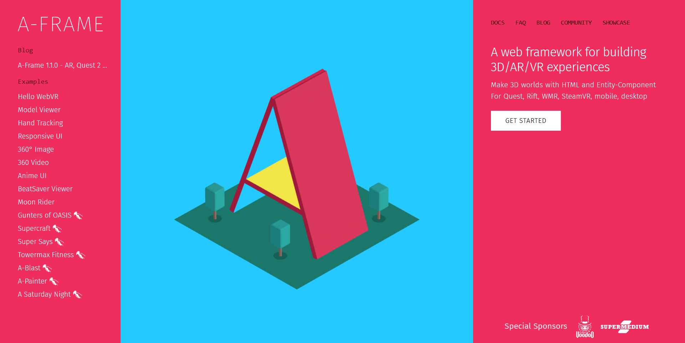
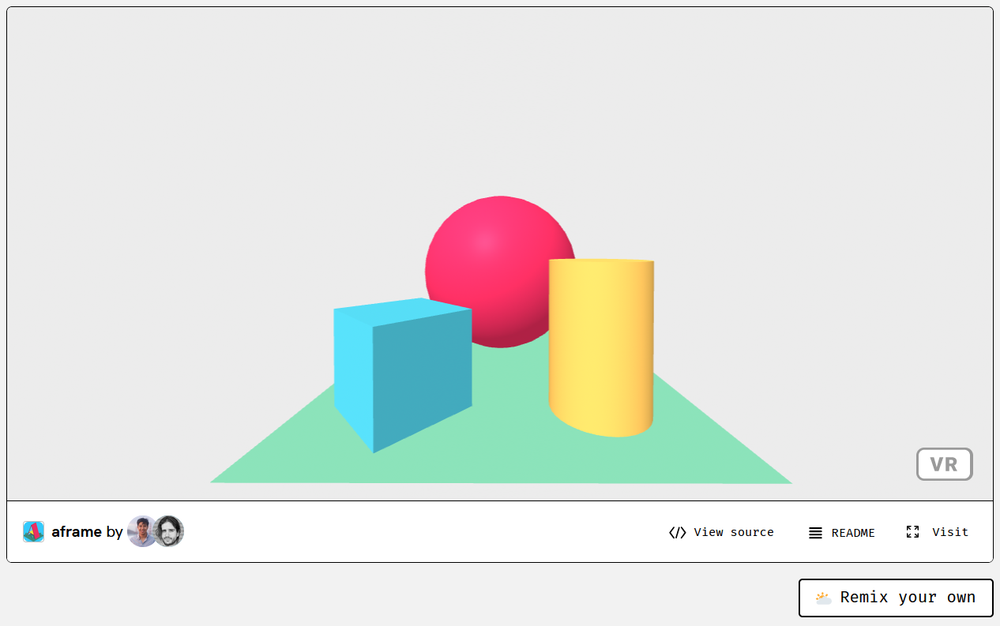
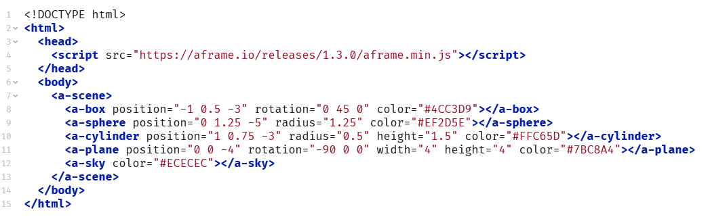

<!--
author:   Peter Wackernagel, Hochschule für Bildende Künste Dresden
email:    wackernagel@hfbk-dresden.de
version:  0.0.1
logo:     A-Frame_logo.png
language: de
narrator: Deutsch Female
comment:  Digitale Räume in VR mit A-Frame 
mode:     Textbook
dark:     true
date:     01/11/2023
@classroom: disable
@sharing: false
-->

# Einführung

[A-Frame](https://aframe.io/) ist ein Open-Source-Projekt, mit dem Sie VR auf regulärem HTML aufbauen können. Sie können also ein WebXR-Erlebnis genauso einfach erstellen wie eine Webseite, indem Sie einfach ein Skript und Markup in Ihre Seite einfügen. Mit A-Frame können Sie plattformübergreifende VR-Anwendungen erstellen, auf die Benutzer mit verschiedenen Geräten zugreifen können.

---

## A-Frame Beispiele

Beispielanwendungen auf der A-Frame-Homepage: [https://aframe.io/](https://aframe.io/)



Die Navigation in den Szenen erfolgt

- auf **Desktop** mit den Pfeiltasten oder WASD (sofern aktiviert)
- auf **mobilen Geräten** mit Fingergesten
- auf **VR-Headsets** durch aktive Körperbewegung.
- Der Button **VR** rechts in der Ecke setzt die Szene in Vollbild beziehungsweise die VR-Ansicht.

Weitere Beispiele: [glitch.com/webxr](https://glitch.com/webxr)

---

## Code Hosting

Damit AFrame im Browser läuft wird eine Server-Umgebung benötigt. Es ist zum Beginnen das Einfachste, die Code-Hosting-Plattform Glitch.com zu nutzen, um ein eigenes Projekt zu entwickeln. Dort finden sich auch zahlreiche Projekte, auf denen aufgebaut werden kann. 

Vorteile von Code-Hosting:

- sofortige Bereitstellung online, es ist kein eigenes Hosting nötig
- volle Funktion dynamischer Scripts

--- 

## Starter Template

Wir nutzen das A-Frame Starter-Template auf Glitch, um ein eigenes Projekt zu beginnen: [https://glitch.com/~aframe](https://glitch.com/~aframe)



- Nutze **Visit**, um die Szene in einem neuen Fenster darzustellen.
- Nutze **View Source**, um den HTML-Quelltext anzusehen.
- Nutze **Remix your own** um ein eigenes Projekt auf dieser Basis zu beginnen.

---

## HTML-Code



- HTML (Hyper Text markup Language) ist die Sprache um Webseiten zu beschreiben.
- A-Frame nutzt diese Sprache um die Objekte der Szene zu beschreiben

---

### Aufbau von HTML-Elementen

#### Tag

```html
<tag></tag>
```

- Ein HTML-Element besteht aus **Tags** gebildet. Es wird immer aus einem opening-tag und einem closing-tag gebildet.
- Tags können unterschiedliche Namen und damit auch verschiedene Funktionen haben.
- tags müssen von spitzen Klammern umgeben werden, das closing-tag hat einen vorangestellten Schrägstrich

---

#### Attribute

```html
<tag attribute></tag>

<tag attribute="value"></tag>
```

- Im opening-tag kann es Attribute geben, die weitere Eigenschaften des Elements definieren.
- Attribute haben oft auch einen Wert, der aus Zahlen, Farbwerten oder Textausdrücken  besteht.
- Attribut und Wert sind ohne Leerzeichen mit dem Ist-Gleich-Zeichen verbunden, der Wert steht immer in Anführungszeichen.

---

#### verschachtelte Elemente

```html
<tag attribute="value">
	<tag2 attribute="value"></tag2>
</tag>
```

- Elemente können ineinander verschachtelt werden.
- Das weitere Element wird dabei zwischen opening-tag und closing-tag gesetzt.

---

#### Kommentare

```html
<tag attribute="value">
	<tag2 attribute="value"></tag2> <!-- hier steht ein Kommentar -->
</tag>
```

- Es können Kommentare eingebaut werden mit Hinweisen zum Code.
- Kommentare werden mit spitzer Klammer, Ausführungszeichen und 2 Minuszeichen eingerahmt wie oben.

---

#### Syntax

```html
<tag attribute="value"></tag>
```

- die richtige Anwendung der Zeichen ist essentiell
- fehlende Klammern oder Anführungszeichen oder zusätzliche Leerzeichen bei Attributen führen zu Fehlern in der Darstellung.
- HTML für Webseiten nutzt noch Inhalt zwischen den Tags. Für AFrame ist dies unnötig.

---

#### Aufbau der HTML-Seite

```html
<!DOCTYPE html>
<html>  
	<head>  <!-- unsichtbarer Teil mit Metadaten und Scripts -->  </head>  
	<body>  <!-- sichtbarer Teil mit Texten, Medien, AFrame-Szene -->  </body>  
</html>
```

- Die Grundstruktur einer HTML-Seite ist immer einheitlich und unterteilt sich in die Bereiche:

	- Head: unsichtbarer Teil mit Metadaten und Scripts
	- Body: sichtbarer Teil mit Texten, Medien, AFrame-Szene

- Leerzeilen können beliebig dazwischen gesetzt werden und erleichtern die Übersicht.
- Es sollte kein Text außerhalb von Tags stehen, mit Ausnahme von Kommentaren.

---

## A-Frame Basisszene

```html
<!DOCTYPE html>
<html>  
  <head>  
    <script src="https://aframe.io/releases/latest/aframe.min.js"></script>  
  </head>  
  <body>  
    <a-scene>  
      <a-box position="-1 0.5 -3" rotation="0 45 0" color="#4CC3D9"></a-box>  
      <a-sphere position="0 1.25 -5" radius="1.25" color="#EF2D5E"></a-sphere>  
      <a-cylinder position="1 0.75 -3" radius="0.5" height="1.5" color="#FFC65D"></a-cylinder>  
      <a-plane position="0 0 -4" rotation="-90 0 0" width="4" height="4" color="#7BC8A4"></a-plane>  
      <a-sky color="#ECECEC"></a-sky>  
    </a-scene>  
  </body>  
</html>
```

Das code-highlighting erleichtert uns das unterscheiden der einzelnen Bestandteile. Je nach verwendetem Programm kann es hier verschiedene Farben geben, die Unterteilung des Syntax (der Code-Sprache) in verschiedene Farben ist jedoch stets dieselbe.

---

### Script

```html
  <head>  
    <script src="https://aframe.io/releases/latest/aframe.min.js"></script>  
  </head>  
```

Das im Head verlinkte Java-Script ist das, was die Szene funktionieren lässt.

Es ist ein Programmcode, der die nachfolgend angegebene Szene interpretiert, darstellt und die Bedienung auf unterschiedlichen Geräten steuert.

Der Programmcode kann angesehen werden durch direkten Aufruf der URL im Browser:
- Datensparsam minimierte Variante: https://aframe.io/releases/latest/aframe.min.js
- Vollständige und gut lesbare Variante: https://aframe.io/releases/latest/aframe.js
- Es gibt verschiedene Versionen des Scripts. Anstatt von *latest* steht oft auch eine bestimmte Versionsnummer, zum Beispiel 1.4.0

---

### Szene

```html
<a-scene>  
	<a-box position="-1 0.5 -3" rotation="0 45 0" color="#4CC3D9"></a-box>  
	<a-sphere position="0 1.25 -5" radius="1.25" color="#EF2D5E"></a-sphere>  
	<a-cylinder position="1 0.75 -3" radius="0.5" height="1.5" color="#FFC65D"></a-cylinder>  
	<a-plane position="0 0 -4" rotation="-90 0 0" width="4" height="4" color="#7BC8A4"></a-plane>  
	<a-sky color="#ECECEC"></a-sky>  
</a-scene>  
```

Die A-frame-Szene wird durch den Tag *a-scene* initialisiert. Die Szenenobjekte befinden sich innerhalb dieses Tags.

Alle zu A-Frame gehörenden Tags haben ein vorangestelltes *a-* um sie von Standard-HTML-Tags zu unterscheiden.

---

Jedes **Element** *a-box*, *a-sphere*, *a-cylinder* etc. beschreibt ein einzelnes **Objekt** innerhalb der Szene mit folgenden Attributen:

- position = x y z = Breite Höhe Tiefe
	- Zahlen getrennt durch Leerzeichen, Angaben in Metern jedoch ohne Angabe der Einheit
	- Tiefe z: -z bewegt von der Kamera weg. Positive Werte befinden sich hinter der Kamera
- rotation: Angaben wie bei position
- radius, width, height: Angaben abhängig von Objekttyp (Zylinder, Fläche)
- color: hexadezimale Angabe: Anteile Rot Grün und Blau:
	- Hex Colors: https://www.w3schools.com/colors/colors_hexadecimal.asp
	- color Picker: https://www.w3schools.com/colors/colors_picker.asp
	- Auch Farbnamen sind möglich: https://www.w3schools.com/colors/colors_names.asp

---

## Übung

> Beginne ein eigenes Projekt durch Remix des [A-Frame Starter Templates](https://glitch.com/~aframe) auf Glitch.
> verändere die Attribute der Elemente um zu sehen, was passiert


# Szene aufbauen

## A-Frame Primitives

### Box

Das Box-Primitiv erzeugt Formen wie Kisten, Würfel oder Wände.

```html
<a-box color="tomato" depth="2" height="4" width="0.5"></a-box>
```

https://aframe.io/docs/1.4.0/primitives/a-box.html

---

### Zylinder

Das Zylinderprimitiv wird zur Erstellung von Rohren und gekrümmten Flächen verwendet.

```html
<a-cylinder color="crimson" height="3" radius="1.5"></a-cylinder>
```

https://aframe.io/docs/1.4.0/primitives/a-cylinder.html

---

### Fläche

Das Flächenprimitiv erzeugt ebene Flächen

```html
<a-plane color="#CCC" height="20" width="20"></a-plane>
```

https://aframe.io/docs/1.4.0/primitives/a-plane.html

---

### Kugel

Das Kugelprimitiv erzeugt eine Kugel- oder Polyederform.

```html
<a-sphere color="yellow" radius="5"></a-sphere>
```

https://aframe.io/docs/1.4.0/primitives/a-sphere.html

---

### Bild

Das Bildprimitiv zeigt ein Bild auf einer ebenen Fläche.

```html
<a-image src="image.jpg" width="3" height="1.5"></a-image>
```

Die Bildgröße ist in Metern und sollte dem Seitenverhältnis des Bildes entsprechen. Ohne Angabe wird es als Quadrat mit 1 x 1 m groß dargestellt.

Alle Bilder, die sich im Internet einfach aufrufen lassen, können mit ihrer URL adressiert werden. Eigene Bilder können auf glitch hochgeladen und von dort verlinkt werden.

https://aframe.io/docs/1.4.0/primitives/a-image.html

---

### Text

Fügt einen Text hinzu.

```html
<a-text value="Hello, World!" height="0.5"></a-text>
```

https://aframe.io/docs/1.4.0/primitives/a-text.html

---

### Sky

Das Himmelprimitiv fügt einer Szene eine Hintergrundfarbe oder ein 360°-Bild hinzu. Ein Himmel ist eine große Kugel, deren Innenseite eine Farbe oder Textur zugewiesen ist. Siehe dazu [[Environment - Sky]]

``` html
<a-sky color="#6EBAA7"></a-sky> <!-- Hintergrundfarbe -->
<a-sky src="sky.jpg"></a-sky> <!-- Hintergrundbild -->
```

https://aframe.io/docs/1.4.0/primitives/a-sky.html

---

### Kamera

Wenn nicht explizit angegeben, wird eine Standardkamera wie unten angegeben in die Szene eingesetzt.
A camera is situated by default at the average height of human eye level (1.6 meters). When used with controls that receive rotation or position (e.g. from a VR device) this position will be overridden.


```html
<a-camera position="0 1.6 0"></a-camera>
```

- Auswahl Attribute (mit Standardangaben)
	- Brennweite: fov="80"
	- Mausinteraktion: reverse-mouse-drag="true"

https://aframe.io/docs/1.4.0/primitives/a-camera.html

---

### Weiteres

Weitere Grundobjekte finden sich in der offiziellen Dokumentation im seitlichen Menu, links ganz unten.

Hinweis zu Audio- und Videodateien: Auch diese lassen sich in A-Frame einbetten, allerdings sind hier häufig weitere Schritte nötig, damit sie korrekt abgespielt werden. Insbesondere bei Apple iOS gibt es Hürden für ein problemloses Abspielen.

---

## A-Frame Entities

A-Frame Elemente können auf 2 Arten angegeben werden: als spezielles Primitive (z.B. a-box) oder als allgemeine entity (a-entity) zusammen mit einer Komponente.  
Primitives (s.o.) sind Vereinfachungen für die Darstellung häufiger Objekte und verweisen innerhalb von A-Frame auf Entities.

```html
<a-box color="red" width="3"></a-box>

<a-entity geometry="primitive: box; width: 3" material="color: red"></a-entity>
```

Ausführliche Informationen dazu unter
- https://aframe.io/docs/1.4.0/introduction/html-and-primitives.html und
- https://aframe.io/docs/1.4.0/introduction/entity-component-system.html

---

### Tipp: Gruppierungen

Entities können auch genutzt werden, um andere Objekte zu gruppieren. So lassen sich mehrere Objekte gemeinsam positionieren, z.B.:

```html
<a-entity position="0 0 -5" rotation="0 45 0">
	<a-box position="-2 0 0"></a-box>
	<a-box position="0 0 0"></a-box>
	<a-box position="2 0 0"></a-box>
</a-entity>
```

 Vergleichbar ist dies in Blender mit der Nutzung eines *empty* als parent für andere Objekte.
 
---

## Übung

> Gestalte eine eigene Szene mit verschiedenen Objekten in A-Frame auf glitch.com
> Besuche deine Szene auf verschiedenen Endgeräten, Mobil und VR-Headset.

