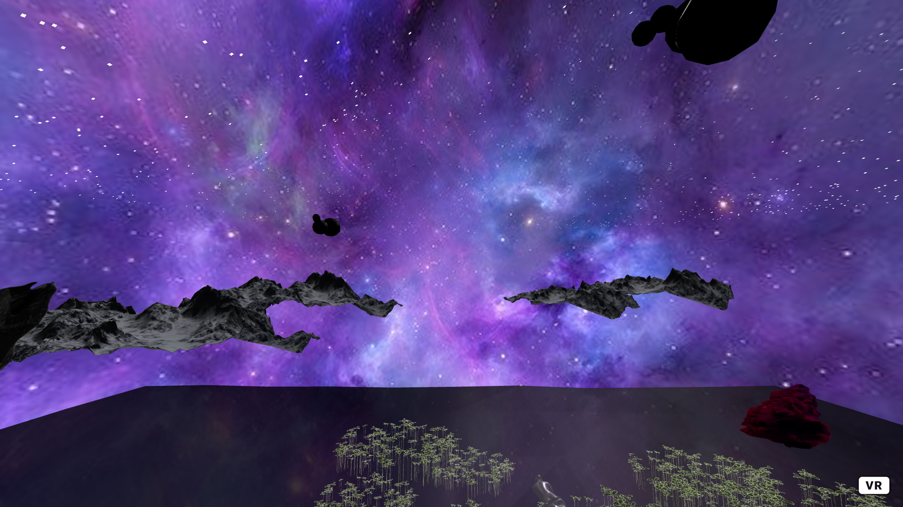
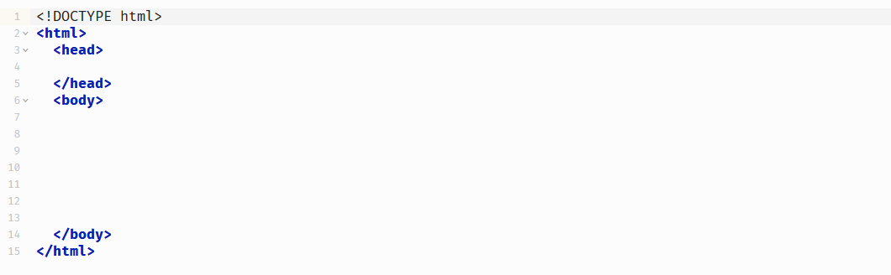
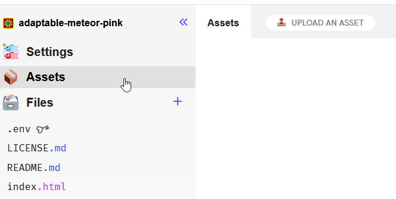

<!--
author:   Peter Wackernagel, Hochschule für Bildende Künste Dresden
email:    wackernagel@hfbk-dresden.de
version:  0.1.0
logo:     aframe_logo.png
language: en
narrator: English Female
comment:  Introduction into A-Frame at MKE
mode:     textbook
dark:     true
date:     15/4/2023
@classroom: disable
@sharing: false
link: lia-style.css
-->

# Introduction into A-Frame


[https://aframe.io/](https://aframe.io/)

A-Frame is a web framework for creating 3D/AR/VR experiences based on standard HTML. With A-Frame you can create cross-platform 3D worlds that users can access with any headset, mobile phone or desktop. Media files such as images, videos, sound and 3D objects can be integrated into the scene. Animations and interactions can be used to create rich and interactive experiences.

---

## Sample Applications

Here are some scenes that students have created over the past few semesters.


https://light-real-tune.glitch.me/

---


https://puffy-dust-yarn.glitch.me/

---


https://snow-honorable-crayon.glitch.me/

---



https://general-evening-sailboat.glitch.me/

---

## What is A-Frame? 

A-Frame is a Java-Script, which is included in an html-page. Scene elements are defined in hyper-text markup language (HTML) and interpreted by the script. 



---

**Basic Webpage**

```html
<!DOCTYPE html>
<html>  
	<head>  
		<!-- metadata, scripts, styles -->
	</head>  
	<body>
		<!-- content intended for display --> 
	</body>  
</html>
```

The tags `<html>`, `<head>` and `<body>` form the framework for every web page.

The text enclosed in `<!-- ... -->` is a comment and will not be displayed. It can be used to annotate the markup and to hide elements.

---

**Script**

```html
<script src="https://aframe.io/releases/1.4.1/aframe.min.js"></script>  
```

A-Frame is a JavaScript that is linked in the header of the page. This contains the programme code that interprets and displays the scene.

*If you want to go into detail and read the code, check out the structured and commented script here: https://aframe.io/releases/latest/aframe.js .*

---

**A-Frame Scene and Elements**

```html
<a-scene>  
	<a-box position="-1 0.5 -3" rotation="0 45 0" color="#4CC3D9"></a-box>  
	<a-sphere position="0 1.25 -5" radius="1.25" color="#EF2D5E"></a-sphere>  
	<a-cylinder position="1 0.75 -3" radius="0.5" height="1.5" color="#FFC65D"></a-cylinder>  
	<a-plane position="0 0 -4" rotation="-90 0 0" width="4" height="4" color="#7BC8A4"></a-plane>  
	<a-sky color="#ECECEC"></a-sky>  
</a-scene>  
```

The digital scene is wrapped in  `<a-scene> ... </a-scene>` and all scene elements are nested within it.

---

# Start your project

The fastest way is to start playing from within the browser.


> [Glitch](https://glitch.com/~aframe) provides an online code editor with instant deployment and hosting of web sites. The editor supports both front-end and back-end code as well as multiple files and directories. Glitch lets us remix (i.e., copy) existing projects and make them our own and instantly host and deploy changes for everyone to see.

*If you are advanced in web developement and prefer to build your project locally, see the installation notes in these [a-frame docs](https://aframe.io/docs/1.4.0/introduction/installation.html#local-development).*

---

## Starter Template

We'll use the A-Frame Starter-Template on glitch.com: https://glitch.com/~aframe


> Hit **Remix your own** to start your own project based on this project.

---


> Open the file navigation on the left and go to index.html. This is the default start page for most websites.

---


> Open the Preview Pane and optionally toggle the file navigation again to get more space to edit the code.

---


> Each **element** `<a-box>`, `<a-sphere>`, `<a-plane>` etc. describes a single **object** within the scene.

--- 


> The **properties** of each Object are attached as **attributes**.

---

## Code editing


> Play around with the attribute values and see the changes directly in the preview.

- position/rotation = x y z = width height depth
- Numbers separated by blanks, in meters, without units
- Decimal separator is `.`
- Depth z: Negative values move objects away from the camera, while positive values are behind the camera and are only seen after you move.
- radius, width, height, ... : depending on object type (cylinder, surface)
- color: hexadecimal value, or color name:
- Hex Colors: https://www.w3schools.com/colors/colors_hexadecimal.asp
- color Picker: https://www.w3schools.com/colors/colors_picker.asp
- color names: https://www.w3schools.com/colors/colors_names.asp

---

**Beware of code errors**


> A red dot on the left will warn you about errors in the code. In this example, the attribute value of radius of the sphere is not closed by `"`.

---

**Save your project**

> If you want to keep your project, you'll need to create an account from your dashboard (glitch logo at top left). Otherwise, the project will be deleted after a few days.

---

**Share your project**


> Each project gets its unique URL and is immediately online. With this the project can be viewed instantly from around the world.

---

# Elements in A-Frame

A-Frame elements can be specified in 2 ways: as a **primitive** or as an **entity with components**.

```html
<a-box color="red" width="3"></a-box>

<a-entity geometry="primitive: box; width: 3" material="color: red"></a-entity>
```

A-Frame is an Entity Component System (ECS), which is common for real-time engines. Entities provide a more flexible way of composing objects in A-Frame.

A handful of elements are provided as primitives that wrap the entity-component pattern to make it appealing for beginners.

To keep things simple, primitives will be used in most cases in this course.

*You can check out the documentation if you want to learn more about [Primitives](https://aframe.io/docs/1.4.1/introduction/html-and-primitives.html) and [Entities](https://aframe.io/docs/1.4.1/introduction/entity-component-system.html).*

## Built-in elements

### `<a-plane>`

The plane primitive creates flat surfaces.

```html
<a-plane position="0 1 -4" rotation="0 45 0" width="4" height="4" color="#7BC8A4"></a-plane>

<a-plane color="grey" height="20" width="20" position="0 0 -10" rotation="-90 0 0"></a-plane> <!-- Ground plane -->
```

---

### `<a-box>`

The box primitive creates shapes such as boxes, cubes, or walls.

```html
<a-box width="0.5" height="2" depth="1" position="-1 1 -4" color="red"></a-box>

<a-box width="1" height="0.5" depth="2" position="1 1 -4" color="green" wireframe="true" wireframe-linewidth="2"></a-box>
```

---

### `<a-cylinder>`

The cylinder primitive is used to create tubes and curved surfaces.

```html
<a-cylinder color="crimson" height="3" radius="1.5" position="0 1 -5"></a-cylinder>
```

---

### `<a-sphere>`

The sphere primitive creates a spherical or polyhedron shapes.

```html
<a-sphere color="yellow" radius="1" position="0 1 -5"></a-sphere>
```

---

### `<a-ring>`

The ring primitive creates a ring or disc shape.

```html
<a-ring color="teal" radius-inner="1" radius-outer="2"></a-ring>
```

---

### `<a-torus>`

The torus primitive creates donut or tube shapes.

```html
<a-torus color="#43A367" arc="270" radius="5" radius-tubular="0.1"></a-torus>
```

---

### `<a-text>`

Adds a text.

```html
<a-text value="Hello, World!" color="black" position="0 1 -3"></a-text>
```

---

### `<a-sky>`

The sky primitive adds a background color to a scene.

``` html
<a-sky color="#6EBAA7"></a-sky> <!-- background color -->
```

---

### `<a-camera>`

Unless explicitly written into the markup, a camera is by default placed at the average height of a human eye (1.6 meters). When used with controls that receive rotation or position (e.g., from a VR device), this position is overridden. Change the Height value to set it to a different height. To change the start position, see below.

```html 
<a-camera position="0 1.6 0" fov="80"></a-camera>  
```

When moving or rotating the camera relative to the scene, use a camera rig. By doing so, the camera’s height offset can be updated by roomscale devices, while still allowing the tracked area to be moved independently around the scene.

```html
<a-entity position="25 10 0">  <!-- Rig -->
	<a-camera></a-camera>  <!-- Camera -->
</a-entity>
```

---

## Group elements

Entities can be used to group objects. This allows several objects to be positioned together, e.g.:

```html
<a-entity position="0 0 -5" rotation="0 45 0">
	<a-box position="-2 0 0"></a-box>
	<a-box position="0 0 0"></a-box>
	<a-box position="2 0 0"></a-box>
</a-entity>
```

---

## Using media assets

Media files such as images, videos, sound and 3D objects can be integrated into the scene.

Since your project is web-based, you need to pay attention to the file format and file size so that the project loads well and runs smoothly. The connection speed and the performance of the end devices always play a major role in this.

> It is recommended to always test projects on different devices and also on those that might be weaker than your target device.

---

Files must be uploaded to the Assets folder.



> To use these, you need the URL to the file:
> 
> - Select the file after upload is complete and you will find a button to copy the URL.
> - add the attribute `src=""` to the element and paste the URL: `src="pasted-url"`

---

### `<a-image>`

The image primitive shows an image on a flat plane.

```html
<a-image src="path/to/image.jpg" width="3" height="2" position="0 1 -5"></a-image>
```

- Use JPG or PNG files.
- Check the (pixel) size of your images. 2K is usually enough, depending on the distance you want visitors to see them in your project.
- Optimize your images for the web using the web export of your favorite application. You can also edit your images online with [Photopea](https://www.photopea.com/).
- In the A-Frame element, set the width and height, preserving the original aspect ratio of the image to avoid distortions. These properties are set in meters, don't confuse them with pixels.
 
---

### `<a-sky>` 

The sky primitive adds a background color or 360° image to a scene. A sky is a large sphere with a color or texture mapped to the inside.

``` html
<a-sky src="path/to/sky.jpg"></a-sky> <!-- equirectangular background-image -->
```

You can download Sky-Images here: https://polyhaven.com/hdris

- Download the 8K Tonemapped-JPG from the menu on the upper right (its a large file).
- Downscale the image (4K: 4096px width is enough) and optimize it for the web.

---

### `<a-gltf-model>`

To use 3D-Models in A-Frame it is recommended to use the glTF Format. Even though it is possible to use other formats, glTF models work with A-Frame more reliably than other formats.

> [glTF](https://www.khronos.org/gltf) (GL Transmission Format) is an open project by Khronos providing a common, extensible format for 3D assets that is both efficient and highly interoperable with modern web technologies.

glTF comes in three variants: gltf separate (gltf+bin+files), gltf embedded (gltf) and gltf binary (glb). In A-Frame it is possible to use the last two: `.gltf` and `.glb`. 

You can export your scene and your objects from most 3D applications or download from like [Polyhaven](https://polyhaven.com/models) or [Sketchfab](https://sketchfab.com/search?features=downloadable&q=low+poly&type=models).

3D objects can be large files. Optimized low-poly models are recommended for real-time viewing. You may need to:

- Optimize the facecount of the mesh (decimate).
- Use low resolution textures, 1K or 2K will be enough
- convert textures to JPEG
- optimize the overall look using modern PBR-Shading methods
- bake lights and procedural textures into texture files

Upload your 3D object into the Assets folder and set your model up in the markup:

```html
<a-gltf-model src="path/to/tree.gltf"></a-gltf-model>
```

Use the attributes position, rotation and scale to set up your model correctly.

---

**Build-in Textures**

If your glTF model uses textures you will need to enable color management in the scene settings like this:

```html
<a-scene renderer="colorManagement: true;">
	<!-- scene content -->
</a-scene>
```

---

The complete code of your scene loading a glTF file with textures and setting the color management correctly could look like this.

```html
<!DOCTYPE html>
<html>
  <head>
    <script src="https://aframe.io/releases/1.4.1/aframe.min.js"></script>  
  </head>
  
  <body>  
    <a-scene renderer="colorManagement: true;"> 
      <a-gltf-model src="path/to/3d-model.glb"></a-gltf-model>
    </a-scene>
  </body>
</html>
```

---

## More

Check out these links to advance:

- A-Frame Documentation: https://aframe.io/docs/1.4.0/introduction/
- A-Frame School: https://aframe.io/aframe-school/
- HTML Basics: https://developer.mozilla.org/de/docs/Learn/Getting_started_with_the_web/HTML_basics
